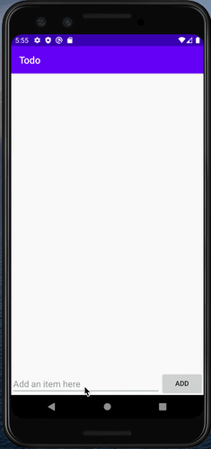
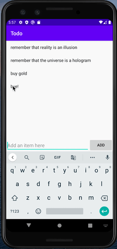
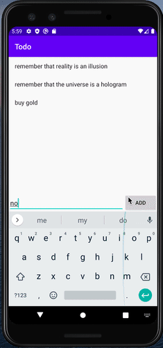

# Project 1 - *Simple Todo*

**Todo** is an android app that allows building a todo list and basic todo items management functionality including adding new items, editing and deleting an existing item.

Submitted by: **Lauren Krieger**

Time spent: **2.5** hours spent in total

## User Stories

The following **required** functionality is completed:

* [x] User can **view a list of todo items**
* [x] User can **successfully add and remove items** from the todo list
* [x] User's **list of items persisted** upon modification and and retrieved properly on app restart

The following **stretch** features are implemented:

* [ ] User can **tap a todo item in the list and bring up an edit screen for the todo item** and then have any changes to the text reflected in the todo list

The following **additional** features are implemented:

* [ ] List anything else that you can get done to improve the app functionality!

## GIF Walkthrough

Here's a walkthrough of implemented user stories:

The user can add items    

The user can remove items. In this case "bye!" is not really a task to do, so it was removed.   

If the user chooses to exit the app, their data is saved   

## Notes

I had some difficulty setting up git and Android Studio, but making the app itself was fine.

## License

    Copyright [2020] [Codepath]

    Licensed under the Apache License, Version 2.0 (the "License");
    you may not use this file except in compliance with the License.
    You may obtain a copy of the License at

        http://www.apache.org/licenses/LICENSE-2.0

    Unless required by applicable law or agreed to in writing, software
    distributed under the License is distributed on an "AS IS" BASIS,
    WITHOUT WARRANTIES OR CONDITIONS OF ANY KIND, either express or implied.
    See the License for the specific language governing permissions and
    limitations under the License.
